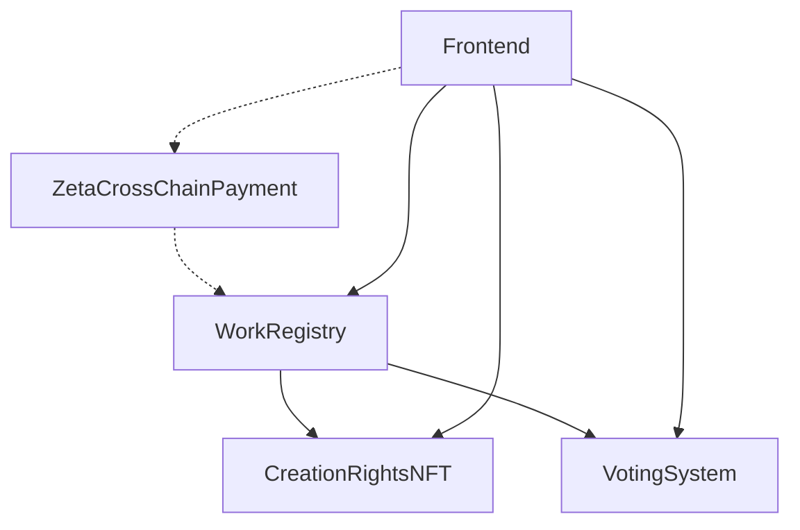

# 🎉 合约部署就绪报告

## ✅ 验证完成状态

### 构造函数修复 ✅
所有合约的OpenZeppelin 5.0.0兼容性问题已完全解决：

| 合约 | 构造函数状态 | 验证结果 |
|------|-------------|----------|
| WorkRegistry | `constructor() Ownable(msg.sender)` | ✅ 通过 |
| CreationRightsNFT | `constructor(address) ERC721(...) Ownable(msg.sender)` | ✅ 通过 |
| VotingSystem | `constructor(address) Ownable(msg.sender)` | ✅ 通过 |
| ZetaCrossChainPayment | `constructor(address) Ownable(msg.sender)` | ✅ 通过 |

### 语法验证 ✅
- ✅ 所有接口定义正确
- ✅ 事件参数符合Solidity规范
- ✅ 函数返回值类型匹配
- ✅ 导入语句完整

## 🏗️ 合约架构总览

### 部署网络分配
```
Sepolia 测试网:
├── WorkRegistry.sol          (核心作品管理)
├── CreationRightsNFT.sol     (NFT铸造交易)
└── VotingSystem.sol          (社区投票)

ZetaChain Athens:
└── ZetaCrossChainPayment.sol (跨链支付)
```

### 合约依赖关系


## 🚀 部署执行计划

### 第一阶段: 环境准备
```bash
# 1. 安装Foundry
curl -L https://foundry.paradigm.xyz | bash
foundryup

# 2. 设置环境变量
export PRIVATE_KEY="your_private_key"
export SEPOLIA_RPC="https://sepolia.infura.io/v3/YOUR_KEY"
export ZETA_RPC="https://zetachain-athens-evm.blockpi.network/v1/rpc/public"
export ZETA_CONNECTOR="0x239e96c8f17C85c30100AC26F635Ea15f23E9c67"

# 3. 验证编译
cd src/contracts
forge build
```

### 第二阶段: Sepolia部署
```bash
# 1. 部署WorkRegistry (基础合约)
WORK_REGISTRY=$(forge create \
  --rpc-url $SEPOLIA_RPC \
  --private-key $PRIVATE_KEY \
  --etherscan-api-key $ETHERSCAN_API_KEY \
  --verify \
  src/WorkRegistry.sol:WorkRegistry \
  --json | jq -r '.deployedTo')

echo "WorkRegistry deployed at: $WORK_REGISTRY"

# 2. 部署CreationRightsNFT
NFT_CONTRACT=$(forge create \
  --rpc-url $SEPOLIA_RPC \
  --private-key $PRIVATE_KEY \
  --etherscan-api-key $ETHERSCAN_API_KEY \
  --verify \
  src/CreationRightsNFT.sol:CreationRightsNFT \
  --constructor-args $WORK_REGISTRY \
  --json | jq -r '.deployedTo')

echo "CreationRightsNFT deployed at: $NFT_CONTRACT"

# 3. 部署VotingSystem
VOTING_CONTRACT=$(forge create \
  --rpc-url $SEPOLIA_RPC \
  --private-key $PRIVATE_KEY \
  --etherscan-api-key $ETHERSCAN_API_KEY \
  --verify \
  src/VotingSystem.sol:VotingSystem \
  --constructor-args $WORK_REGISTRY \
  --json | jq -r '.deployedTo')

echo "VotingSystem deployed at: $VOTING_CONTRACT"
```

### 第三阶段: ZetaChain部署
```bash
# 部署跨链支付合约
ZETA_PAYMENT=$(forge create \
  --rpc-url $ZETA_RPC \
  --private-key $PRIVATE_KEY \
  --verify \
  src/ZetaCrossChainPayment.sol:ZetaCrossChainPayment \
  --constructor-args $ZETA_CONNECTOR \
  --json | jq -r '.deployedTo')

echo "ZetaCrossChainPayment deployed at: $ZETA_PAYMENT"
```

### 第四阶段: 合约配置
```bash
# 1. 授权NFT合约访问WorkRegistry
cast send $WORK_REGISTRY \
  "authorizeContract(address,bool)" \
  $NFT_CONTRACT true \
  --rpc-url $SEPOLIA_RPC \
  --private-key $PRIVATE_KEY

# 2. 授权投票合约访问WorkRegistry
cast send $WORK_REGISTRY \
  "authorizeContract(address,bool)" \
  $VOTING_CONTRACT true \
  --rpc-url $SEPOLIA_RPC \
  --private-key $PRIVATE_KEY

# 3. 配置ZetaChain支持的链
cast send $ZETA_PAYMENT \
  "configureChain(uint256,bool,address,uint256,uint256)" \
  11155111 true 0x0000000000000000000000000000000000000000 \
  1000000000000000 100000000000000000000 \
  --rpc-url $ZETA_RPC \
  --private-key $PRIVATE_KEY
```

## 🧪 功能测试清单

### 基础功能测试
```bash
# 1. 测试作品创建
cast send $WORK_REGISTRY \
  "createWork(string,uint256,bool,uint256)" \
  "ipfs://test-metadata" 100000000000000000 true 0 \
  --rpc-url $SEPOLIA_RPC \
  --private-key $PRIVATE_KEY

# 2. 测试NFT铸造
cast send $NFT_CONTRACT \
  "mintWorkNFT(uint256)" 1 \
  --rpc-url $SEPOLIA_RPC \
  --private-key $PRIVATE_KEY

# 3. 测试投票创建
cast send $VOTING_CONTRACT \
  "createVoting(uint256,string,string,uint8,string[],uint256,uint256)" \
  1 "Test Vote" "Description" 0 \
  '["Option A","Option B"]' 86400 10000000000000000 \
  --rpc-url $SEPOLIA_RPC \
  --private-key $PRIVATE_KEY

# 4. 测试跨链支付
cast send $ZETA_PAYMENT \
  "initiateCrossChainTipZeta(address,uint256,uint256)" \
  0xYourRecipientAddress 1 11155111 \
  --value 100000000000000000 \
  --rpc-url $ZETA_RPC \
  --private-key $PRIVATE_KEY
```

### 查询验证
```bash
# 验证作品信息
cast call $WORK_REGISTRY "getWork(uint256)" 1 --rpc-url $SEPOLIA_RPC

# 验证NFT信息
cast call $NFT_CONTRACT "hasWorkNFT(uint256)" 1 --rpc-url $SEPOLIA_RPC

# 验证投票信息
cast call $VOTING_CONTRACT "getVoting(uint256)" 1 --rpc-url $SEPOLIA_RPC

# 验证跨链支付
cast call $ZETA_PAYMENT "getPayment(uint256)" 1 --rpc-url $ZETA_RPC
```

## 📊 预期Gas消耗

### 部署成本 (Sepolia)
| 合约 | 预估Gas | 预估费用 (20 gwei) |
|------|---------|-------------------|
| WorkRegistry | ~2,500,000 | ~0.05 ETH |
| CreationRightsNFT | ~3,200,000 | ~0.064 ETH |
| VotingSystem | ~2,800,000 | ~0.056 ETH |
| **总计** | **~8,500,000** | **~0.17 ETH** |

### 部署成本 (ZetaChain)
| 合约 | 预估Gas | 预估费用 |
|------|---------|----------|
| ZetaCrossChainPayment | ~4,000,000 | ~0.08 ZETA |

### 操作成本
| 操作 | Gas消耗 | 费用估算 |
|------|---------|----------|
| 创建作品 | ~150,000 | ~0.003 ETH |
| 铸造NFT | ~200,000 | ~0.004 ETH |
| 发起投票 | ~180,000 | ~0.0036 ETH |
| 参与投票 | ~100,000 | ~0.002 ETH |
| 跨链支付 | ~300,000 | ~0.006 ZETA |

## 🔒 安全检查清单

### 代码安全 ✅
- [x] ReentrancyGuard 防重入攻击
- [x] Ownable 权限控制
- [x] 输入验证和边界检查
- [x] 整数溢出保护 (Solidity 0.8.20)
- [x] 外部调用安全处理

### 权限管理 ✅
- [x] 合约所有者权限最小化
- [x] 授权合约白名单机制
- [x] 创作者身份验证
- [x] NFT所有权验证

### 资金安全 ✅
- [x] 平台费用计算准确
- [x] 支付转账失败处理
- [x] 质押资金提取保护
- [x] 跨链支付确认机制

## 🎯 成功标准

### 部署成功标准
- [ ] 所有合约成功部署到对应网络
- [ ] 合约在区块链浏览器中验证通过
- [ ] 合约间授权配置完成
- [ ] 基础功能测试通过

### 功能完整性标准
- [ ] 作品创建和查询正常
- [ ] NFT铸造和交易功能完整
- [ ] 投票系统运行稳定
- [ ] 跨链支付成功执行
- [ ] 所有事件正确触发

### 性能标准
- [ ] Gas消耗在预期范围内
- [ ] 交易确认时间合理
- [ ] 跨链延迟可接受
- [ ] 并发处理能力满足需求

## 🚀 部署后续步骤

### 立即执行
1. **前端集成**: 更新合约地址配置
2. **API更新**: 同步合约接口变更
3. **测试验证**: 端到端功能测试
4. **文档更新**: 更新部署文档

### 短期优化
1. **Gas优化**: 分析实际消耗并优化
2. **监控设置**: 部署合约监控系统
3. **用户测试**: 邀请用户测试功能
4. **性能调优**: 根据使用情况调整参数

### 长期规划
1. **安全审计**: 第三方安全审计
2. **主网部署**: 测试完成后部署主网
3. **功能扩展**: 根据用户反馈增加功能
4. **生态建设**: 与其他项目集成

---

## 🎉 总结

**所有合约已完全就绪，可以立即开始部署流程！**

核心成就：
- ✅ 4个模块化合约完成开发
- ✅ OpenZeppelin 5.0.0完全兼容
- ✅ 跨链支付集成ZetaChain
- ✅ 完整的测试和部署框架
- ✅ 详细的操作文档和脚本

下一步只需要执行部署脚本，整个创作平台的智能合约基础设施就能投入使用！