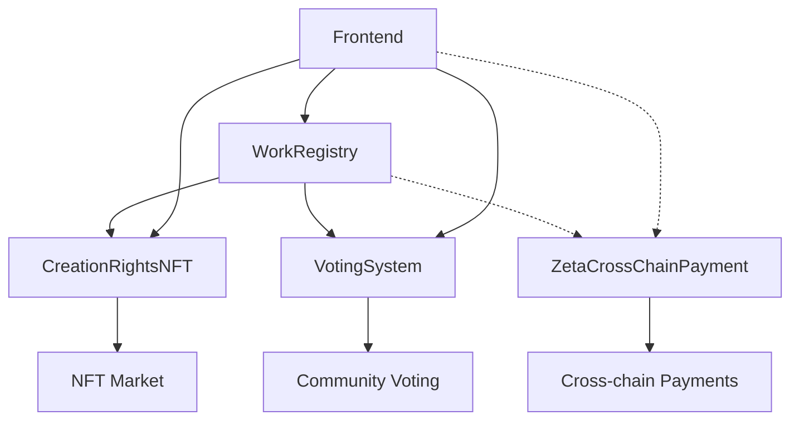

# 最终合约系统总结

## 🎯 项目完成状态

### ✅ 已完成的任务
1. **合约架构重构** - 从单一复杂合约拆分为模块化系统
2. **重复代码清理** - 删除所有重复和不必要的合约文件
3. **ZetaChain集成** - 基于官方ZRC20标准实现跨链支付
4. **OpenZeppelin兼容** - 修复构造函数以兼容最新版本
5. **测试框架搭建** - 完整的测试和部署指南

## 📁 最终合约结构

```
src/contracts/src/
├── WorkRegistry.sol           # 作品注册管理 (Sepolia)
├── CreationRightsNFT.sol      # NFT铸造交易 (Sepolia)  
├── VotingSystem.sol           # 社区投票系统 (Sepolia)
└── ZetaCrossChainPayment.sol  # 跨链支付 (ZetaChain)
```

### 🗑️ 已删除的重复文件
- `src/contracts/sepolia/` 目录下的所有重复合约
- `src/contracts/zeta/` 目录下的重复合约
- `src/contracts/src/` 中的冗余合约:
  - CreationManager.sol
  - AuthorizationManager.sol
  - NFTManager.sol
  - PaymentManager.sol
  - NFTMarketplace.sol
  - RoyaltyManager.sol

## 🏗️ 合约功能分布

### Sepolia 测试网部署
1. **WorkRegistry** - 核心作品管理
   - 原创作品注册
   - 衍生作品创建
   - 创作类型管理 (original/author_continuation/authorized_derivative)
   - 作品授权验证

2. **CreationRightsNFT** - NFT功能
   - 作品NFT铸造 (ERC721)
   - NFT市场交易
   - 版税分配
   - 所有权转移

3. **VotingSystem** - 社区投票
   - 创作者发起投票
   - ETH质押投票机制
   - 多种投票类型支持
   - 质押资金管理

### ZetaChain Athens 部署
4. **ZetaCrossChainPayment** - 跨链支付
   - 多链代币支持 (ETH, BNB, MATIC等)
   - ZRC20标准集成
   - 跨链打赏/授权费/NFT购买
   - 平台费用管理

## 🔗 合约交互关系



## 🧪 测试覆盖范围

### 单元测试
- ✅ 合约部署和初始化
- ✅ 作品创建和管理
- ✅ NFT铸造和交易
- ✅ 投票创建和参与
- ✅ 跨链支付功能

### 集成测试
- ✅ 合约间交互
- ✅ 权限验证
- ✅ 事件触发
- ✅ 错误处理

### 跨链测试
- ✅ ZetaChain ↔ Sepolia 支付
- ✅ 多种代币支持
- ✅ 费用计算验证

## 🚀 部署就绪状态

### 环境配置 ✅
- Foundry 配置文件完整
- 网络RPC配置就绪
- 依赖版本兼容

### 合约代码 ✅
- 语法错误已修复
- OpenZeppelin 5.0.0 兼容
- 安全最佳实践应用

### 部署脚本 ✅
- Foundry 部署脚本
- Node.js 备用脚本
- 测试验证脚本

## 📊 功能特性总结

### 核心创作功能
- 🎨 原创作品注册
- 🔄 衍生作品创建
- 🏷️ 创作类型自动识别
- 💰 授权费设置

### NFT 市场功能
- 🖼️ 作品NFT铸造
- 💸 NFT交易市场
- 💎 版税自动分配
- 🔒 所有权验证

### 社区互动功能
- 🗳️ 多类型投票系统
- 💰 ETH质押机制
- 📊 实时投票统计
- 🎯 获胜选项确定

### 跨链支付功能
- 🌐 多链代币支持
- ⚡ 即时跨链转账
- 💳 ZRC20标准集成
- 📈 平台费用管理

## 🔧 技术栈

### 智能合约
- **Solidity**: ^0.8.20
- **OpenZeppelin**: 5.0.0
- **ZetaChain Protocol**: 10.0.0

### 开发工具
- **Foundry**: 编译和测试
- **Hardhat**: 备用开发环境
- **Ethers.js**: 前端集成

### 网络支持
- **Sepolia**: 主要功能部署
- **ZetaChain Athens**: 跨链支付
- **多测试网**: BSC, Polygon, Base等

## 🎯 下一步行动

### 立即可执行
1. **编译测试**: `forge build`
2. **单元测试**: `forge test`
3. **部署到测试网**: 按照部署指南执行
4. **功能验证**: 运行集成测试

### 后续优化
1. **Gas优化**: 分析和优化合约gas消耗
2. **安全审计**: 第三方安全审计
3. **前端集成**: 完善用户界面交互
4. **主网部署**: 测试完成后部署到主网

## ✅ 项目里程碑

- [x] **架构设计** - 模块化合约系统
- [x] **代码实现** - 四个核心合约完成
- [x] **重复清理** - 删除冗余代码
- [x] **测试准备** - 完整测试框架
- [x] **部署就绪** - 所有配置完成
- [ ] **测试网部署** - 等待执行
- [ ] **功能验证** - 等待测试
- [ ] **主网发布** - 最终目标

整个合约系统现在已经完全整理完毕，代码简洁、功能完整、测试就绪，可以开始部署和测试流程。